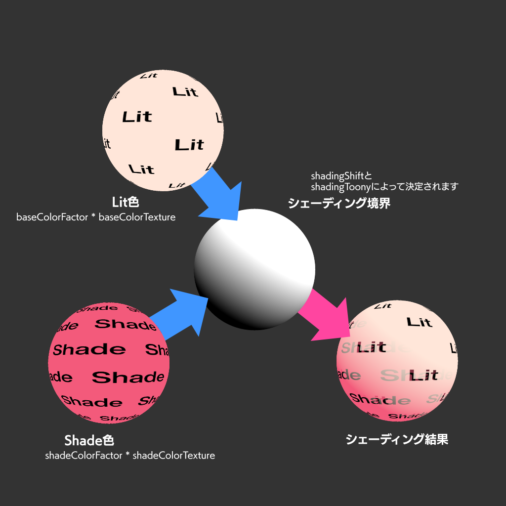
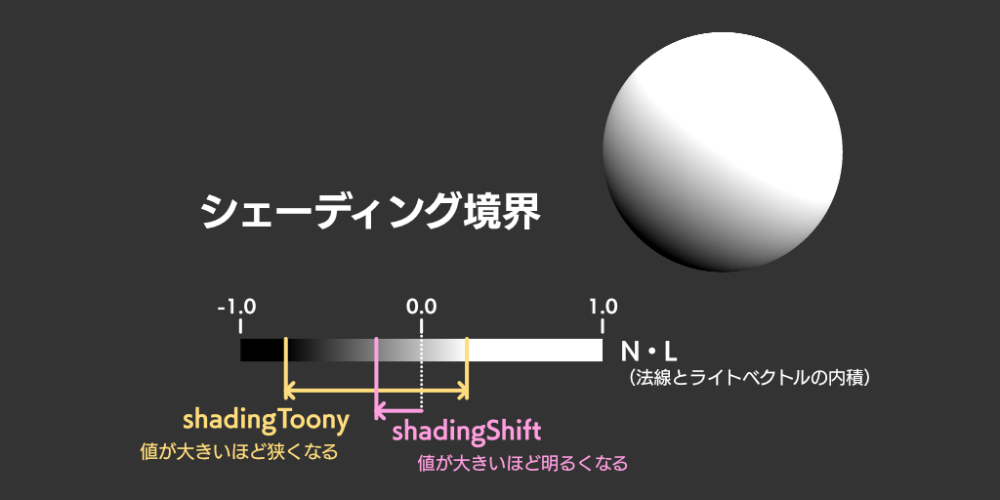

# VRMC_materials_mtoon 

## Contributors

## Dependencies

Written against the glTF 2.0 spec.

## Overview

この拡張は、 VRM 向けのトゥーンシェーダ実装です。
トゥーンシェーダ的な効果を付与しつつ、 PBR のシーンライティングと協調することを目的とします。
日本の手描きアニメ表現への特化はしません。

## Extending Materials

マテリアルの `extensions` に定義します。

```json
{
    "materials": [
        {
            "name": "MyUnlitMaterial",
            "pbrMetallicRoughness": {
                "baseColorFactor": [ 0.5, 0.8, 0.0, 1.0 ]
                // texture
            },
            // emission

            "extensions": {
                "VRMC_materials_mtoon": {

                }
            }
        }
    ]
}
```

## Definition

### Types
型定義のうち Color と Texture は glTF に準じて Linear Colorspace で格納されます。

### Coordinates
UV 座標系について


### BRDF


### Meta

MToon 自体のメタ情報に関する定義を述べます。

#### MToon Defined Properties

|         | 型      | 説明             | 必須 |
|---------|---------|----------------|:-----|
| version | integer | この拡張のバージョン番号 | ✅    |

#### version

この拡張のバージョン番号を示します。

今後、仕様と異なる重篤なバグが実装に発覚し、それを修正することによって多くのモデルに影響が及ぶ事態が発生した場合に、このバージョン情報を参照して Migration を行うような用途を想定しています。


### Rendering

描画に関する MToon の定義を述べます。

#### Render Mode

このマテリアルがどのようなアルファ処理で描画されるのかを指定します。
アルファ値は、 glTF の仕様で定義される `pbrMetallicRoughness.baseColorFactor` および `pbrMetallicRoughness.baseColorTexture` で定義されるアルファ値を参照します。
アルファ値の処理は、 glTF の仕様で定義される `alphaMode` および `alphaCutoff` を用います。
それぞれの処理の詳細については、 glTF の仕様に準拠します。

glTF で定義される `alphaMode` に加え、本拡張では `transparentWithZWrite` というプロパティを提供します。
通常 `alphaMode` が `BLEND` の際は、 ZBuffer に対する書き込みを推奨しませんが、
このプロパティが `true` の場合、 `alphaMode` が `BLEND` の際に、 ZBuffer に対する書き込みを推奨します。

> `transparentWithZWrite` の実装が困難な場合、通常のアルファブレンディングの処理にフォールバックしてください。

#### Render Queue

このマテリアルがどのような順番で描画されるべきなのかを指定します。
MToon は次のような順番で描画されることを期待します。

1. `alphaMode` が `OPAQUE`
2. `alphaMode` が `MASK`
3. `alphaMode` が `BLEND` かつ `transparentWithZWrite` が `true`
3. `alphaMode` が `BLEND` かつ `transparentWithZWrite` が `false`

トゥーンシェーダでは半透明表現が多用されるため、描画順序に起因する問題が発生しがちです。
MToon ではそのために `transparentWithZWrite` を導入していますが、さらに描画順制御の仕組みを導入しています。
`renderQueueOffsetNumber` はそれぞれの Render Mode のデフォルト描画順に対するオフセット値です。
Unity におけるマテリアルごとの Render Queue 値に対してオフセットとして加算される挙動を期待します。
`renderQueueOffsetNumber` は `alphaMode` が `BLEND` のときに作用します。
値が大きいほど、描画の順番は後回しにされます。
値のとりうる範囲について次の表に示します。

|                                                            | Min Value | Max Value |
|:-----------------------------------------------------------|:----------|:----------|
| `alphaMode` が `OPAQUE`                                     | `0`       | `0`       |
| `alphaMode` が `MASK`                                       | `0`       | `0`       |
| `alphaMode` が `BLEND` かつ `transparentWithZWrite` が `true`  | `0`       | `+9`      |
| `alphaMode` が `BLEND` かつ `transparentWithZWrite` が `false` | `-9`      | `0`       |

`renderQueueOffsetNumber` がどのような値になったとしても、前述の Render Queue による描画の順番の方が優先されます。

MToon ではない他の glTF モデルなどと併せてレンダリングを行う場合、それらの `renderQueueOffsetNumber` は `0` と仮定して描画順を制御してください。

Unity における Render Queue 相当の描画順制御が実装で困難な場合は、 `renderQueueOffsetNumber` が `0` であるとみなしてください。

#### MToon Defined Properties

|                           | 型        | 説明                                             | 必須                |
|:--------------------------|:----------|:-----------------------------------------------|:------------------|
| `transparentWithZWrite`   | `boolean` | `alphaMode` が `BLEND` のとき、 ZBuffer への書き込みを行うか | No, 初期値: `false` |
| `renderQueueOffsetNumber` | `integer` | 描画順に対するオフセット値                               | No, 初期値: `0`     |

#### transparentWithZWrite

`alphaMode` が `BLEND` のとき、 ZBuffer への書き込みを行うかを指定します。

- 型: `boolean`
- 必須: No, 初期値: `false`

#### renderQueueOffsetNumber

前述した Render Queue のオフセット値を指定します。

- 型: `integer`
- 必須: No, 初期値: `0`


### Lighting

ライティングに関する定義を述べます。

#### Lighting Model

MToon は Lambert 反射モデルを拡張します。
通常の Lambert 反射モデルと同様、面の法線とライトベクトルによって陰影が付けられますが、以下のような特徴を持つことで、トゥーン表現を可能とします:

- 通常のベースカラーとは別に、陰色の指定ができます。
- 陰の境界の位置および広さ（ぼかし具合）を調整することができます。

#### Lit Color

ベースカラーは、 glTF コア仕様のマテリアル定義に含まれる `pbrMetallicRoughness.baseColorFactor` および `pbrMetallicRoughness.baseColorTexture` を用います。

#### Shade Color

MToonでは、ベースカラーとは別に、陰色の指定ができます。

通常の Lambert 反射モデルの場合、光の当たっていない陰の面は黒くレンダリングされますが、 MToon ではベースカラーと陰色が線形補間されるような挙動となります。
また、ベースカラーがテクスチャによって乗算されるのと同様、陰色に対しても陰色用のテクスチャを別途指定することができ、テクスチャ色が陰色に対して乗算されます。

陰色は、 MToon 拡張によって定義される `shadeColorFactor` および `shadeMultiplyTexture` を用います。



#### Surface Normal

法線マップを利用できます。 glTF コア仕様のマテリアル定義に含まれる `normalTexture` を用います。

#### Shading Shift

MToon では、面の法線とライトベクトルの内積に応じてベースカラーと陰色を線形補間しますが、このベースカラーと陰色の境界の位置および広さ（ぼかし具合）を調整することができます。

シェーディング境界の位置は、 MToon 拡張によって定義される `shadingShiftFactor` および `shadingShiftTexture` を用います。
シェーディング境界の広さ（ぼかし具合）は、 MToon 拡張によって定義される `shadingToonyFactor` を用います。

`shadingShiftTexture` は、 `shadingShiftFactor` によって設定されるシェーディング境界の位置を調整します。
このテクスチャによって、部分的に光のあたり方を調整することができます。
`shadingShiftTexture` は、 `shadingShiftFactor` と加算で処理されます。
また、 `shadingShiftTexture.scale` を用いて、このテクスチャがシェーディング境界にどの程度寄与するかを制御することができます。



#### Implementation

以下に、擬似コードでライティング処理の実装例を示します:

```
function linearstep( a: Number, b: Number, t: Number ): Number
  return saturate( ( t - a ) / ( b - a ) )
end function

let shading: Number = dot( N, L )
shading = shading + shadingShiftFactor
shading = shading + texture( shadingShiftTexture, uv ) * shadingShiftTexture.scale
shading = linearstep( -1.0 + shadingToonyFactor, 1.0 - shadingToonyFactor, shading )

let baseColorTerm: ColorRGB = baseColorFactor.rgb * texture( baseColorTexture, uv ).rgb
let shadeColorTerm: ColorRGB = shadeColorFactor.rgb * texture( shadeMultiplyTexture, uv ).rgb

let color: ColorRGB = lerp( baseColorTerm, shadeColorTerm, shading )
color = color * lightColor
```

#### MToon Defined Properties

|                      | 型          | 説明                           | 必須                     |
|:---------------------|:------------|:------------------------------|:-------------------------|
| shadeColorFactor     | `number[3]` | Shade色                        | No, Default: `[0, 0, 0]` |
| shadeMultiplyTexture | `object`    | Shade色の乗算テクスチャ              | No                       |
| shadingShiftFactor   | `number`    | シェーディング境界をシフトする値            | No, Default: `0.0`       |
| shadingShiftTexture  | `object`    | シェーディング境界をシフトするテクスチャ         | No                       |
| shadingToonyFactor   | `number`    | シェーディング境界を平滑度合いを指定する値 | No, Default: `0.9`       |

#### shadeColorFactor

陰色を指定します。
値はリニア色空間で評価されます。

- 型: `number[3]`
- 必須: No, 初期値: `0.0`

#### shadeMultiplyTexture

陰色に乗算されるテクスチャを指定します。
テクスチャの値はsRGB色空間で評価されます。

`shadeColorFactor` で設定された値に対して乗算されます。
アサインされていない場合、 `shadeColorFactor` で設定した値がそのまま適用されます。

- 型: `object`
- 必須: No

#### shadingShiftFactor

シェーディング境界をシフトする値を指定します。

具体的にどう計算がされるかについては、上記 [Shading Shift](#Shading%20Shift) を参照ください。

- 型: `number`
- 必須: No, 初期値: `0.0`

#### shadingShiftTexture

シェーディング境界をシフトするテクスチャを指定します。

具体的にどう計算がされるかについては、上記 [Shading Shift](#Shading%20Shift) を参照ください。

テクスチャの値はリニア色空間で評価されます。
アサインされたテクスチャのRコンポーネントを参照します。

> アサインされたテクスチャのRコンポーネントを参照するため、白黒のマスクテクスチャを使用することもできますし、チャンネルごとに他のマスクを持ったRGBのテクスチャを利用することもできます。
> `outlineWidthMultiplyTexture` (Gチャンネルを使う) および `uvAnimationMaskTexture` (Bチャンネルを使う) を組み合わせることができます。

- 型: `object`
- 必須: No

#### shadingToonyFactor

シェーディング境界の広さ（ぼかし）を指定します。

具体的にどう計算がされるかについては、上記 [Shading Shift](#Shading%20Shift) を参照ください。

- 型: `number`
- 必須: No, 初期値: `0.9`

### shadingShiftTextureInfo

`shadingShiftTexture` でテクスチャを指定するオブジェクトです。

#### Properties

|          | 型        | 説明                             | 必須              |
|:---------|:----------|:---------------------------------|:------------------|
| index    | `integer` | テクスチャのindex                      | ✅ Yes             |
| texCoord | `integer` | テクスチャマッピングに用いるTEXCOORD          | No, 初期値: `0`   |
| scale    | `number`  | テクスチャのシェーディング境界への寄与を指定する値 | No, 初期値: `1.0` |

#### shadingShiftTextureInfo.index ✅

テクスチャのindexを指定します。

- 型: `integer`
- 必須: Yes
- 最小値: `>= 0`

#### shadingShiftTextureInfo.texCoord

テクスチャマッピングをするに際し、参照するTEXCOORDを指定します。

- 型: `integer`
- 必須: No, 初期値: `0`
- 最小値: `>= 0`

#### shadingShiftTextureInfo.scale

テクスチャのシェーディング境界への寄与を指定します。
この値はリニア値です。

- 型: `number`
- 必須: No, 初期値: `1.0`

### Global Illumination

TODO

#### MToon Defined Properties

|                   | 型       | 説明              | 必須               |
|:------------------|:---------|:----------------|:-------------------|
| giIntensityFactor | `number` | 大域照明の寄与係数 | No, Default: `0.1` |

#### giIntensityFactor

TODO

- 型: `number`
- 必須: No, 初期値: `0.1`

### Emission

エミッションを利用できます。
glTF コア仕様のマテリアル定義に含まれる `emissiveFactor` および `emissiveTexture` を用います。

### Rim Lighting

リムライティングに関する定義を述べます。

#### MatCap

MatCap は View Normal Vector を基にマッピングする手法です。
主に事前にライティングを焼き込む用途で広く使われています。
MatCapは、ライティング結果に対して加算されます。

テクスチャは、MToon拡張によって定義される `additiveTexture` に格納されます。

#### Parametric Rim Lighting

パラメトリックリムライトは、 View Normal Vector を基にして、オブジェクトの縁に疑似リムライト効果を与える手法です。
パラメトリックリムライトは、ライティング結果に対して加算されます。

MToon拡張によって定義される `rimColorFactor` という値で、パラメトリックリムライトの色を制御できます。

また、MToon拡張によって定義される `rimFresnelPowerFactor` ・ `rimLiftFactor` という値で、パラメトリックリムライトの形状を制御することができます。
形状は、 `pow( saturate( 1.0 - dot( N, V ) + rimLiftFactor ), rimFresnelPowerFactor )` という数式で求められます。

#### Rim Multiply Texture

特定の箇所だけリムライティングを出す・消すといった制御をテクスチャを用いて行うことができます。
UV マッピングされたテクスチャの値がリムライト色に対して乗算されます。

テクスチャは、MToon拡張によって定義される `rimMultiplyTexture` に格納されます。

#### Rim Lighting Mix

リムライティングが周囲の光源からどのくらい影響を受けるかを制御することができます。
まったく影響を受けない場合、エミッションのように自己発光するリムライティングとなります。
影響を受ける場合、光源の色がリムライティングの色に乗算されます。

MToon拡張によって定義される `rimLightingMixFactor` で設定した値に応じて、光源の色の影響度合いが線形に変化します。

#### Implementation

以下に、擬似コードでリムライティング処理の実装例を示します:

```
let rim: ColorRGB

let worldViewX: Vector3 = normalize( Vector3( V.z, 0.0, -V.x ) )
let worldViewY: Vector3 = cross( V, x )

let matcapUv: Vector2 = Vector2( dot( x, N ), dot( y, N ) ) * 0.495 + 0.5

rim = texture( additiveTexture, matcapUv ).rgb

let parametricRim: Number = saturate( 1.0 - dot( N, V ) + rimLiftFactor )
parametricRim = pow( parametricRim, rimFresnelPowerFactor )

rim = rim + parametricRim * rimColorFactor

rim = rim * texture( rimMultiplyTexture, uv ).rgb

rim = rim * lerp( ColorRGB( 1.0, 1.0, 1.0 ), lightColor, rimLightingMixFactor )

-- color にはライティング結果が含まれているものとする
color = color + rim
```

#### MToon Defined Properties

|                       | 型          | 説明                      | 必須                    |
|:----------------------|:------------|:--------------------------|:------------------------|
| additiveTexture       | `object`    | MatCap テクスチャ              | No                      |
| rimColorFactor        | `number[3]` | パラメトリックリムライトの色           | No, 初期値: `[0, 0, 0]` |
| rimFresnelPowerFactor | `number`    | パラメトリックリムライトのフレネル係数     | No, 初期値: `5.0`       |
| rimLiftFactor         | `number`    | パラメトリックリムライトの加算項       | No, 初期値: `0.0`       |
| rimMultiplyTexture    | `object`    | リムライティングに対して乗算されるテクスチャ | No                      |
| rimLightingMixFactor  | `number`    | リムライティングの光源からの影響の割合 | No, 初期値: `1.0`       |

#### additiveTexture

MatCap テクスチャを指定します。
テクスチャの値はsRGB色空間で評価されます。

- 型: `object`
- 必須: No

#### rimColorFactor

パラメトリックリムライトの色を指定します。
値はリニア色空間で評価されます。

- 型: `number[3]`
- 必須: No, 初期値: `[0, 0, 0]`

#### rimFresnelPowerFactor

パラメトリックリムライトのフレネル項を指定します。

具体的にどう計算がされるかについては、上記 [Parametric Rim Lighting](#Parametric%20Rim%20Lighting) を参照ください。

- 型: `object`
- 必須: No, 初期値: `5.0`

#### rimLiftFactor

パラメトリックリムライトの加算項を指定します。

具体的にどう計算がされるかについては、上記 [Parametric Rim Lighting](#Parametric%20Rim%20Lighting) を参照ください。

- 型: `object`
- 必須: No, 初期値: `0.0`

#### rimMultiplyTexture

リムライティングに対して乗算されるテクスチャを指定します。
テクスチャの値はsRGB色空間で評価されます。

- 型: `object`
- 必須: No

#### rimLightingMixFactor

リムライティングが周囲の光源からどのくらい影響を受けるかを設定します。

- 型: `number`
- 必須: No, 初期値: `1.0`

### Outline

輪郭線描画に関する定義を述べます。

輪郭線はトゥーンシェーダにおける大切なファクタのひとつです。

#### Implementation

ラスタライズベースのレンダリングパイプラインにおいては、輪郭線は通常、面とは別のレンダリングパスで描画されます。
MToon の輪郭線は Skinning 後の頂点情報を基に計算されます。
この頂点情報には移動後の位置、回転後の法線が含まれます。

> mesh をマルチパスで描画するのが難しい環境・マルチパス描画の負荷が高い環境では、輪郭線の描画を省略するフォールバックを行ってください。

#### MToon Defined Properties

|                             | 型          | 説明                                 | 必須                    |
|-----------------------------|-------------|------------------------------------|-------------------------|
| outlineWidthMode            | `string`    | 輪郭線の描画モード                       | No, 初期値: `"none"`    |
| outlineWidthFactor          | `number`    | 輪郭線幅                             | No, 初期値: `0.0`       |
| outlineWidthMultiplyTexture | `object`    | 輪郭線幅指定テクスチャ                    | No                      |
| outlineColorFactor          | `number[3]` | 輪郭線色                             | No, 初期値: `[0, 0, 0]` |
| outlineLightingMixFactor    | `float`     | 輪郭線色に表面のシェーディング結果を乗算する割合 | No, 初期値: `0.0`       |

#### outlineWidthMode

輪郭線の幅をどのように決定するかを指定します。

`none` の場合、輪郭線は表示されません。
`worldCoordinates` の場合、輪郭線の幅はワールド座標系の距離に応じて決定されます。
`screenCoordinates` の場合、輪郭線の幅はスクリーン座標系に依存して決定され、距離に関わらず常に一定の太さとなります。

> 基本的には、モデラーが `outlineWidthMode` および `outlineWidthFactor` で設定された幅で輪郭線を描画することが推奨されますが、
> アプリケーションによっては、モデルとカメラが十分に近い場合のみ指定された幅で描画し、モデルとカメラが遠い場合は輪郭線を細くするような挙動を実現したいケースもあり得ます（VRM0系における `OutlineScaledMaxDistance` の挙動）。
> 実際の輪郭線の幅は、アプリケーションの需要に応じて設定してください。

- 型: `string`
- 必須: No, 初期値: `"none"`
- 許可された値:
  - `none`
  - `worldCoordinates`
  - `screenCoordinates`

#### outlineWidthFactor

輪郭線の幅を指定します。
単位は、 `outlineWidthMode` が `worldCoordinates` の場合はメートル、 `screenCoordinates` の場合は画面の縦幅に対する割合とします。

- 型: `number`
- 必須: No, 初期値: `0.0`

#### outlineWidthMultiplyTexture

輪郭線の幅を調整するテクスチャです。

`outlineWidthFactor` で設定された値に対して乗算されます。
アサインされていない場合、マスクは適用されず、数値で設定した値がそのまま適用されます。

- 型: `object`
- 必須: No

#### outlineColorFactor

輪郭線の色を指定します。

- 型: `number[3]`
- 必須: No, 初期値: `[0, 0, 0]`

#### outlineLightingMixFactor

輪郭線の色に表面のシェーディング結果を乗算する割合を指定します。
この値を `0.0` にすると、輪郭職はライティングに依らず常に `outlineColorFactor` で指定した色でレンダリングされます。
輪郭線の色に対してライティングの影響を及ぼしたい場合、この値を `1.0` にします。

- 型: `number`
- 必須: No, 初期値: `0.0`

### UV Animation

UV アニメーション機能を用いて、 MToon で用いられるテクスチャをアニメーションさせることができます。
アニメーションは制御ができるものではなく、自動的・恒常的なものです。

UV アニメーションによる座標変換の際に、 UV の各要素が取りうる値の範囲をclampやrepeatなどによって [0.0 - 1.0] にすることは行いません。テクスチャの `wrapS` および `wrapT` が `REPEAT` および `MIRRORED_REPEAT` に設定してあることを想定した仕様です。

UV アニメーションによって作用されるテクスチャは、 MToon で定義しているテクスチャのうち、以下となります:

- `shadeMultiplyTexture`
- `shadingToonyMultiplyTexture`
- `rimMultiplyTexture`
- `outlineWidthMultiplyTexture`

また、 glTF のコア仕様で定義される以下のテクスチャに対しても作用します:

- `pbrMetallicRoughness.baseColorTexture`
- `normalTexture`

> View Normal Vector をもとに計算される `AdditiveTexture` テクスチャについては、本拡張による UV アニメーションの対象外となります。

> Implementation Note: 本拡張およびコア仕様外で定義されるテクスチャについては、特に規定をしません。必要に応じて、各実装ごとの対応を行ってください。

#### Compatibility with KHR_texture_transform

`KHR_texture_transform` 拡張を利用している場合、 UV アニメーションによるテクスチャの座標変換は `KHR_texture_transform` による座標変換より先に実行されます。

> `KHR_texture_transform` を併用する場合においても、 UV アニメーションによる座標変換の際に、 UV の各要素が取りうる値の範囲をclampやrepeatなどによって [0.0 - 1.0] にすることは行いません。

#### MToon Defined Properties

|                                | 型       | 説明                           | 必須              |
|--------------------------------|----------|------------------------------|-------------------|
| uvAnimationMaskTexture         | `object` | UV アニメーションを行う範囲を指定するテクスチャ | No                |
| uvAnimationScrollXSpeedFactor  | `number` | UV アニメーションの X 方向の移動速度    | No, 初期値: `0.0` |
| uvAnimationScrollYSpeedFactor  | `number` | UV アニメーションの Y 方向の移動速度    | No, 初期値: `0.0` |
| uvAnimationRotationSpeedFactor | `number` | UV アニメーションの回転速度            | No, 初期値: `0.0` |

#### uvAnimationMaskTexture

UV アニメーションを行う範囲を指定するテクスチャです。

`uvAnimationScrollXSpeedFactor` ・ `uvAnimationScrollYSpeedFactor` ・ `uvAnimationRotationSpeedFactor` で設定された数値に対して乗算されます。
アサインされていない場合、マスクは適用されず、数値で設定した値がそのまま適用されます。

マスクのように使われることを想定しています。

テクスチャの値はリニア色空間で評価されます。
アサインされたテクスチャのBコンポーネントを参照します。

> アサインされたテクスチャのBコンポーネントを参照するため、白黒のマスクテクスチャを使用することもできますし、チャンネルごとに他のマスクを持ったRGBのテクスチャを利用することもできます。
> `shadingShiftMultiplyTexture` (Rチャンネルを使う) および `outlineWidthMultiplyTexture` (Gチャンネルを使う) を組み合わせることができます。

- 型: `object`
- 必須: No

#### uvAnimationScrollXSpeedFactor

UV アニメーションの X 方向の移動速度を指定します。
単位は UV 座標系毎秒となり、 `1.0` の場合は1秒ごとに UV が1スクロールします。
スクロールの向きは、この値が正の場合に UV が正の方向に単調増加する方向です。

- 型: `number`
- 必須: No, 初期値: `0.0`

#### uvAnimationScrollYSpeedFactor

UV アニメーションの Y 方向の移動速度を指定します。
単位は UV 座標系毎秒となり、 `1.0` の場合は1秒ごとに UV が1スクロールします。
スクロールの向きは、この値が正の場合に UV が正の方向に単調増加する方向です。

- 型: `number`
- 必須: No, 初期値: `0.0`

#### uvAnimationRotationSpeedFactor

UV アニメーションの回転速度を指定します。
単位はラジアン毎秒となり、 `1.0` の場合は2π秒ごとに UV が1回転します。
UV 座標系における (0.5, 0.5) を中心に回転します。
回転方向は、 UV 座標系における反時計回りです（i.e. 画像が時計回りに動く向き）。

- 型: `number`
- 必須: No, 初期値: `0.0`


## Extension compatibility and fallback materials
MToon の実装が難しい場合 `KHR_materials_unlit` にフォールバックしてください。
